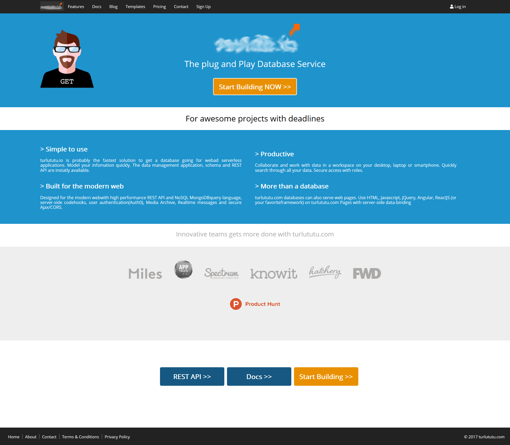

# Reproduction Layout

Exercice en **HTML** et **CSS** durant mon premier mois de formation consistant a reproduire un layout à l'identique.

Lien vers le repo d'exercice [ici](https://github.com/becodeorg/CRL-Woods-2.15/tree/master/Parcours/01-Prairie/05.HTML-CSS/progressive-enhancement).

